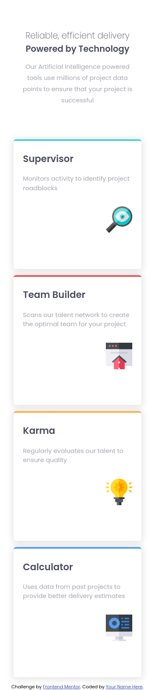
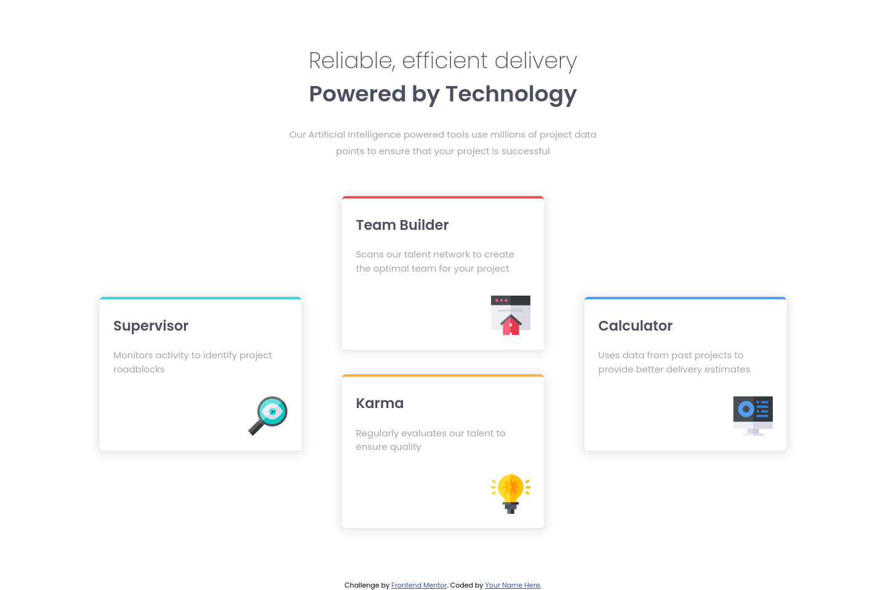

# Frontend Mentor - Four card feature section solution

This is a solution to the [Four card feature section challenge on Frontend Mentor](https://www.frontendmentor.io/challenges/four-card-feature-section-weK1eFYK). Frontend Mentor challenges help you improve your coding skills by building realistic projects. 

## Table of contents

- [Overview](#overview)
  - [The challenge](#the-challenge)
  - [Screenshot](#screenshot)
  - [Links](#links)
- [My process](#my-process)
  - [Built with](#built-with)
  - [What I learned](#what-i-learned)
- [Author](#author)
- [Acknowledgments](#acknowledgments)

## Overview
A nice layout-based challenge for beginners. This will test anyone who is new to multi-column and responsive layouts.
### The challenge

Users should be able to:

- View the optimal layout for the site depending on their device's screen size

### Screenshot

### Links

- Solution URL: [Add solution URL here](https://your-solution-url.com)
- Live Site URL: [Add live site URL here](https://your-live-site-url.com)

## My process
- I read CSS Tricks guide and search tutorial about grid in youtube in able to solve this project
### Built with

- Semantic HTML5 markup
- CSS Grid
- Mobile-first workflow

### What I learned

Learn about using Grid and realizing using grid template area makes workflow easier
## Author

- Frontend Mentor - [Troy](hhttps://www.frontendmentor.io/profile/troy03)
- Github - [@troy03](https://github.com/troy03)

## Acknowledgments

Thanks to frontendmentor for providing this design and shoutout to @vcarames for helping me finishing this project.
